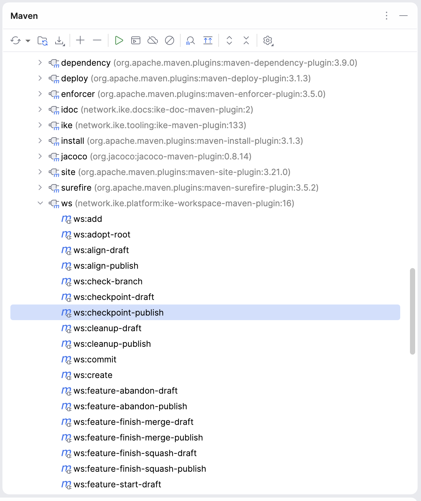
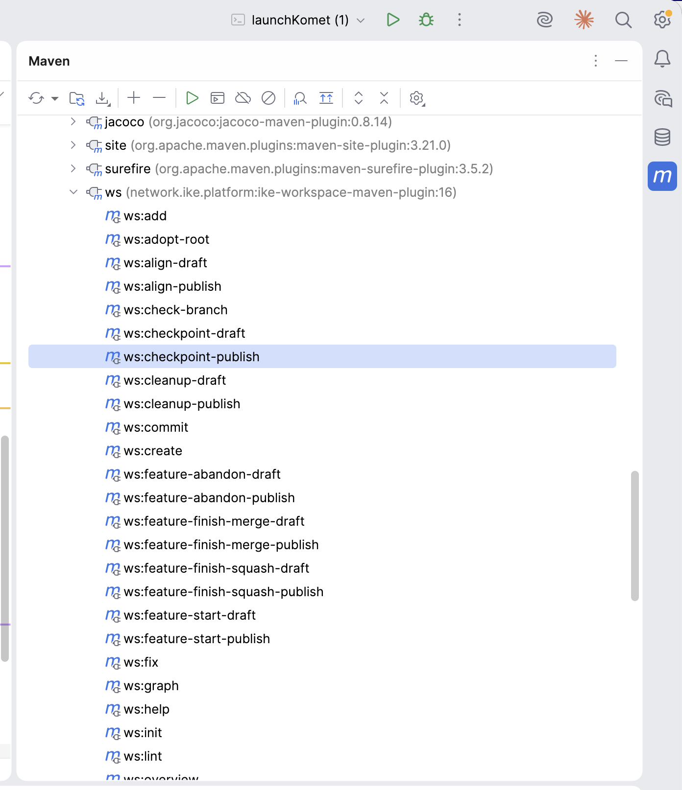

# IKE Workspace Maven Plugin

The `ike-workspace-maven-plugin` provides the `ws:*` goal prefix — 50 goals that coordinate cross-repository operations across an IKE workspace. Where bare git only sees one repo at a time, the workspace plugin fans out across every checked-out subproject in topological order.

| Coordinate | Value |
| --- | --- |
| Group ID | `network.ike.platform` |
| Artifact ID | `ike-workspace-maven-plugin` |
| Goal prefix | `ws:` |
| Packaging | `maven-plugin` |
| Java version | 25 |

## [#when-to-reach-for-it](#when-to-reach-for-it)When to reach for it

A workspace is a directory containing one or more git repositories described by a single `workspace.yaml` manifest. Use this plugin whenever an operation spans more than one repo:

- Creating a feature branch in 5 repos that resolve to each other via internal SNAPSHOT versions.
- Releasing 3 components in topological order so each downstream consumer’s release sees the upstream’s freshly published artifact.
- Pulling, pushing, or committing across the workspace in one command instead of `cd`-ing into each subproject.
- Auditing the workspace state — manifest consistency, dependency convergence, hygiene gates.

If your operation only touches one repo, plain `git` is the right tool. The workspace plugin is for fanning out.

## [#documentation](#documentation)Documentation

| Page | Purpose |
| --- | --- |
| [ws:* Goal Reference](ws-goals.html)[1] | Comprehensive per-goal docs. Every goal, what it does, key parameters, examples. Quick-reference table at the top. |
| [Workspace Lifecycle](workspace-lifecycle.html)[2] | Narrative tour. The state machine of a workspace and how the `ws:*` goals are the named transitions between states. Read this first if you’re new to the workspace model. |

## [#the-two-phase-pattern](#the-two-phase-pattern)The two-phase pattern

Most `ws:*` goals that mutate state come in a draft/publish pair:

```
mvn ws:align-draft        # report what would change, write nothing
mvn ws:align-publish      # apply the changes
```

The bare goal name (`ws:align`) is wired to the draft variant. This is a deliberate convention from ike-issues#200: every workspace mutation is two-phase, with a real chance to audit the draft before committing.

Goals that are purely read-only (e.g., `ws:overview`, `ws:graph`) do not have a publish counterpart — they are always safe.

## [#per-goal-markdown-reports](#per-goal-markdown-reports)Per-goal markdown reports

Every `ws:*` goal writes its output to a markdown file alongside `workspace.yaml` (e.g., `ws꞉overview.md`, `ws꞉release-draft.md`). The colon in filenames uses the modifier-letter form (`U+A789`) so unix tooling treats the names as plain identifiers.

Use `ws:report` to list and open them — newest first — in your default file manager.

## [#quick-start--intellij-idea](#quick-start--intellij-idea)Quick start — IntelliJ IDEA

Open the workspace project in IntelliJ. The Maven tool window (right sidebar, **View → Tool Windows → Maven** if hidden) auto-discovers the `ws:*` goals from this plugin’s `<pluginManagement>` declaration in `ike-parent`.

 

Expand the `ws (network.ike.platform:ike-workspace-maven-plugin:…​)` entry to see all 50 goals as clickable items:

 

Common interactions:

- **Run a read-only goal** (`ws:overview`, `ws:lint`, `ws:release-status`) — **double-click** the goal in the tree. Output appears in the Run tool window at the bottom.
- **Run a goal with parameters** (e.g. `ws:feature-start-publish` needs `-Dfeature=`…​) — **right-click** the goal → **Modify Run Configuration…** → fill `Properties` (e.g. `feature=my-thing,subproject=tinkar-core`) → **Run**.
- **Pin frequently-used invocations** — once a Run Configuration is saved, it appears in the toolbar dropdown for one-click access on subsequent runs.
- **Discover goals** — `ws:help` prints the registry, but the Maven tool window has all goals visible by name without running anything.

Goal naming follows the draft/publish convention — bare names (e.g. `ws:align`) preview without writing; `-publish` variants apply.

## [#quick-start--command-line](#quick-start--command-line)Quick start — Command line

```
# In a directory with workspace.yaml + cloned subprojects:
mvn ws:overview                              # see what you have
mvn ws:sync                                  # daily-driver: pull + push
mvn ws:feature-start-publish -Dfeature=foo   # new feature branch
mvn ws:feature-finish-squash-publish -Dfeature=foo

# Discovering goals at runtime:
mvn ws:help                                  # generated from WsGoal enum
```

For a complete first-time-setup walkthrough, see [Workspace Getting Started](../workspace-getting-started.html)[3].

## [#source](#source)Source

- GitHub: [ike-platform/ike-workspace-maven-plugin](https://github.com/IKE-Network/ike-platform/tree/main/ike-workspace-maven-plugin)[4]
- Issues: [IKE-Network/ike-issues](https://github.com/IKE-Network/ike-issues)[5] (cross-project tracker)
