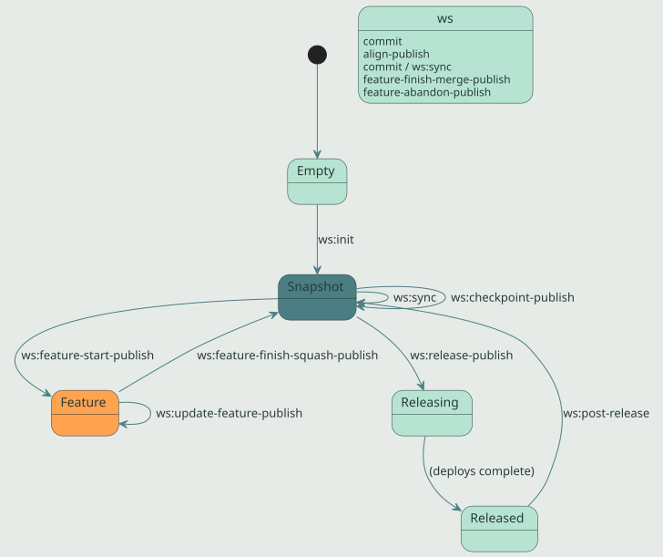

= Workspace Lifecycle
:icons: font
:source-highlighter: coderay
:toc: left
:toclevels: 2

This page tells the story of how `ws:*` goals fit together day-to-day.
For a per-goal reference, see link:ws-goals.html[ws:* Goal Reference].

The mental model is a finite state machine. A workspace is in one of
five states at any moment, and `ws:*` goals are the named transitions
between them. Knowing where you are and where you want to be tells
you which goal to invoke next.

== State machine

The five states:

[cols="1,3", options="header"]
|===
| State | Meaning

| *Empty*       | Filesystem has no `workspace.yaml`. Bare git operations only.
| *Snapshot*    | Workspace cloned and aligned. All subprojects on `main` branch with `*-SNAPSHOT` versions. The default daily-driver state.
| *Feature*    | A coordinated `feature/<name>` branch active across N subprojects with branch-qualified SNAPSHOT versions.
| *Releasing*  | A release is in flight. `release/<version>` branches exist; `v<version>` tags may be created but not yet pushed.
| *Released*   | All subprojects in the release set are tagged at `v<version>`, deployed to Nexus, and merged back to `main`.
|===

Most days you are in *Snapshot* moving in and out of *Feature*. The
`Releasing` state should be transient — a few minutes between
`ws:release-publish` and the moment everything is on Nexus and pushed.
If you find yourself in *Releasing* for longer (a release was
interrupted), `ws:release-status` is the diagnostic to run first.

== Day one: bootstrapping a workspace

A workspace is a directory containing `workspace.yaml` and one or
more cloned subproject repositories. The most common bootstrap is
"clone the workspace meta-repo, then clone each subproject described
inside it":

[source,bash]
----
git clone git@github.com:IKE-Network/ike-example-ws.git
cd ike-example-ws
mvn ws:init                # clone every subproject in workspace.yaml
mvn ws:overview            # see what you have
----

If the subproject directories already exist on disk (e.g., Syncthing
carried them over from another machine without their `.git/`
directories), `ws:init` initializes git in place rather than cloning,
preserving the working tree.

To add a new repo to an existing workspace:

[source,bash]
----
mvn ws:add -Drepo=git@github.com:IKE-Network/new-component.git
----

To start a workspace from scratch in a fresh directory, see
link:workspace-getting-started.html[Workspace Getting Started].

== Daily flow: stay in sync

Once bootstrapped, the daily rhythm is `sync` → work → `commit` →
`sync`:

[source,bash]
----
mvn ws:sync                # pull, refresh-main, push (everything)
# ... edit code ...
mvn ws:commit -Dmessage="..."
mvn ws:sync
----

`ws:sync` replaces the older two-step `ws:pull` followed by
`ws:push`. Between the two, it also calls `ws:refresh-main` so
local main stays current with `origin/main` even on machines where
Syncthing carries an out-of-band checkout. Use the standalone
`ws:pull`, `ws:push`, and `ws:refresh-main` only when you specifically
want one of the three operations alone.

After `ws:sync`, run `ws:overview` if you want a one-screen status
report (manifest + graph + git state + cascade impact).

== Feature flow: coordinated branches

A feature branch in a workspace is *coordinated* — same branch name
in N subprojects at once, with branch-qualified SNAPSHOT versions
that resolve internally. This lets you make changes that touch
multiple repos and verify them locally before merging.

[source,bash]
----
mvn ws:feature-start-publish -Dfeature=my-thing
# Creates feature/my-thing in every subproject with a branch-qualified
# SNAPSHOT version (e.g., 1.2.0-my-thing-SNAPSHOT).
# Inter-subproject deps auto-align so the branch starts consistent.

# ... edit code ...
mvn ws:commit -Dmessage="my work in progress"
mvn ws:push                # publish the feature branch

# Periodically catch up with main:
mvn ws:update-feature-publish

# When done, choose merge or squash:
mvn ws:feature-finish-squash-publish -Dfeature=my-thing -Dmessage="Ship it"
# OR for long-lived branches:
mvn ws:feature-finish-merge-publish -Dfeature=my-thing
----

Squash is the default and the recommended path for most features —
the feature branch's commit history is disposable, and main gets one
clean commit. Use `feature-finish-merge` only for long-lived feature
branches where you want individual commits visible on main.

If a feature should be discarded:

[source,bash]
----
mvn ws:feature-abandon-draft                         # preview what would be lost
mvn ws:feature-abandon-publish -Dfeature=my-thing    # delete after confirmation
----

To switch between feature branches without releasing:

[source,bash]
----
mvn ws:switch-publish                                # interactive menu
mvn ws:switch-publish -Dbranch=feature/another       # non-interactive
----

== Release flow: coordinated multi-repo release

A workspace release tags, deploys, and pushes every subproject in
the release set in topological order. The release set is the union of
two groups:

* *source-changed* — subprojects with unreleased commits since their
  last tag.
* *cascade-pulled* — subprojects whose upstream got released, so they
  need a new release that consumes the new upstream version, even if
  they themselves had no commits.

Before kicking off a release, run inspection goals:

[source,bash]
----
mvn ws:overview                # broad health check
mvn ws:verify                  # manifest consistency + git state
mvn ws:verify-convergence      # transitive dep convergence
mvn ws:lint                    # preflight hygiene gate
----

Then draft the release to see the plan:

[source,bash]
----
mvn ws:release-draft           # writes ws꞉release-draft.md
----

Review the draft. If it looks right, execute:

[source,bash]
----
mvn ws:release-publish
----

Per-subproject catch-up alignment runs *immediately before each
subproject's release*: every workspace-internal upstream version
reference (parent, version property) is bumped to the upstream's
just-released version. This means a downstream component released
second sees the upstream's actual release, not the snapshot it had
when the release started.

After release, bump everything to the next development version:

[source,bash]
----
mvn ws:post-release -DnextVersion=22-SNAPSHOT
----

If something goes wrong mid-release, do *not* run `release-publish`
again until you know what state you're in:

[source,bash]
----
mvn ws:release-status          # read-only diagnostic
----

The output gives you a punch list per subproject and a recommended
next action — typically pointing at `IKE-RELEASE-RECOVERY.md`.

== Checkpoints: tag without releasing

Sometimes you want to mark a workspace state for reproduction without
running a full release — no POM version changes, no deploys, just
git tags. Use `ws:checkpoint`:

[source,bash]
----
mvn ws:checkpoint-draft -Dlabel=before-refactor
mvn ws:checkpoint-publish -Dlabel=before-refactor
----

The publish variant aligns first so the checkpoint captures a
consistent inter-subproject state. TeamCity watches for checkpoint
tags on the workspace repo and runs CI verification — the artifact
side stays SNAPSHOT.

Checkpoints are intermediate; they are *not* released to Nexus and
*should not* be consumed as a stable version by anything outside the
workspace.

== Alignment: the daily safety net

Before any state-changing operation (especially feature-start or
release), the workspace must be aligned — every workspace-internal
dependency reference must point at the version another workspace
subproject actually has. Drift causes builds to resolve a stale
artifact from Nexus instead of the local subproject.

`ws:align-draft` previews the changes; `ws:align-publish` applies
them. Both are safe and idempotent; run them whenever you've manually
edited POM versions or when a release left the workspace in a
mixed state.

[source,bash]
----
mvn ws:align-draft             # preview
mvn ws:align-publish           # apply
----

To cascade a parent POM bump (e.g., `ike-parent` 19 → 20) across the
workspace:

[source,bash]
----
mvn ws:set-parent-publish -DnewVersion=20
----

`ws:set-parent` only touches the parent reference; it does *not*
align inter-subproject dep versions. Pair with `ws:align-publish`
afterward to converge both axes.

For the rare case where `workspace.yaml`'s recorded branch and the
on-disk git checkout have drifted apart (e.g., a manual rebase moved
some subprojects to a branch the YAML doesn't know about), use the
recovery goal:

[source,bash]
----
mvn ws:reconcile-branches-draft       # preview the YAML edits
mvn ws:reconcile-branches-publish     # apply
----

This is recovery / rare-use, separated from `ws:align` per
ike-issues#200's two-axis split: POM versions vs. git branches are
fundamentally different things and should not share a single
"realign" verb.

== Inspection always

Read-only goals are safe at any time. They are the right starting
point for almost any operation:

[cols="1,2", options="header"]
|===
| Goal | When to reach for it

| `ws:overview`            | Default first command. Manifest + graph + status + cascade in one screen.
| `ws:verify`              | Before you push. Catches manifest drift, broken refs.
| `ws:verify-convergence`  | Before a release. Catches transitive dep version conflicts.
| `ws:lint`                | Anytime. Surfaces hygiene problems (typo'd jvm.config, leaking SNAPSHOT properties).
| `ws:graph`               | When the dep graph is what you want to see. `-Dformat=dot` for Graphviz.
| `ws:release-status`      | Suspicious of an in-flight release. Diagnoses what's left to do.
| `ws:report`              | Browse the markdown reports every other ws goal writes.
|===

== Upgrades: keeping standards current

As workspace conventions and toolchain versions evolve, two upgrade
goals pull a workspace forward:

[source,bash]
----
# Build-tooling versions (parents, plugins, dependencies):
mvn ws:versions-upgrade-draft         # writes versions-upgrade-plan.yaml
mvn ws:versions-upgrade-publish       # applies the plan

# Scaffold conventions (gitignore, hooks, IDE configs, .mvn/maven.config):
mvn ws:scaffold-upgrade-draft         # preview
mvn ws:scaffold-upgrade-publish       # apply
----

Both goals are idempotent and safe to re-run. `versions-upgrade` uses
OpenRewrite for POM edits — never sed/regex.

== When git fights back

A few situations need `git` directly rather than `ws:*`:

* Resolving a real merge conflict — fix files, `git add`, `git commit`,
  then re-run the workspace goal.
* Discarding local changes in *one* subproject — `git checkout .` or
  `git reset --hard` in that subproject only.
* Inspecting one repo's history — `git log` in that subproject.

But for any *workspace-wide* git operation, prefer the `ws:*` goal —
the topological ordering, per-goal reports, and consistent error
recovery are why the plugin exists.

== See also

* link:ws-goals.html[ws:* Goal Reference] — full goal-by-goal docs.
* link:workspace-getting-started.html[Workspace Getting Started] —
  hands-on first-time setup.
* link:index.html[Workspace Plugin Home] — module overview.
